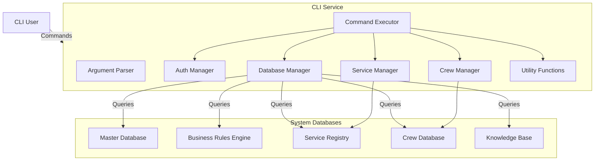

# 🖥️ CLI Microservice

A lightweight Command Line Interface (CLI) microservice for interacting with the Sovereign Biz Box architecture, providing quick access to core features, configuration management, and database operations.


## 📋 Overview

The CLI microservice acts as a developer-friendly interface to the Sovereign Biz Box ecosystem. It allows you to perform essential operations directly from your terminal, including:

- Managing crew assignments and configurations
- Interacting with microservice health and status
- Performing database operations
- Accessing system diagnostics
- Executing quick scripts and utility functions

## 🚀 Features

### 👥 Crew Management
- Create, update, and delete crew definitions
- Assign specific engineers and specialists to crews
- Validate crew configurations against master database
- Quick crew assignment from terminal

### 📊 Service Operations
- View all registered microservices
- Check service health and status
- Get detailed service information
- Trigger service discovery and updates

### 🗄️ Database Management
- List all SQLite databases
- Query databases with SQL
- Get database schema and table information
- Validate database connections

### 📋 System Diagnostics
- Check system health and connectivity
- View active services and crews
- Get system statistics
- Access configuration settings

### ⚡ Quick Operations
- Execute Python scripts with context
- Trigger pipeline workflows
- Test integrations
- Run custom commands

## 🛠️ Prerequisites

- **Python 3.12+**
- **pip** (Python package installer)
- **SQLite3** (usually included with Python)
- **Referenced microservices** (auth, service registry, etc.)

## 🛠️ Installation

1. **Clone the repository**
```bash
git clone <repository-url>
cd cli
```

2. **Install dependencies**
```bash
pip install -r requirements.txt
```

## 🏃 Usage

The CLI microservice provides several command-line commands for interacting with the Sovereign Biz Box ecosystem. You can run commands like:

### Basic Commands
```bash
# Help
python cli.py --help

# Health check
python cli.py health

# List all services
python cli.py services list

# List crews
python cli.py crews list

# Query a database
python cli.py db query "SELECT * FROM customers" --db customers_db
```

### Crew Management
```bash
# Create a new crew
python cli.py crews create --name "DevOps Crew" --lead "lead-engineer-id" --specialist "integration-specialist-id"

# Update crew configuration
python cli.py crews update --id 123 --specialist "new-specialist-id"

# List all crews with details
python cli.py crews list --detailed
```

### Service Management
```bash
# View service details
python cli.py services details --name auth_service

# Check service health
python cli.py services health --name data_pipeline

# Trigger service discovery
python cli.py services discover --force
```

### Database Operations
```bash
# List all databases
python cli.py db list

# Get database schema
python cli.py db schema --db business_rules_engine

# Execute federated query (with semantic layer)
python cli.py db federated "SELECT u.name, o.total FROM customers JOIN orders ON ..." --dbs auth_db orders_db
```

### Utility Commands
```bash
# Generate project scaffolding
python cli.py generate --type microservice --name new_service --path ../microservices

# Run custom Python script
python cli.py run script.py --args "--option value"

# Quick deployment
python cli.py deploy --service data_pipeline --environment staging
```

## 🗄️ Database Integration

The CLI service interacts with several core databases in the Sovereign Biz Box architecture:

- **Master Database** (`refactor_master.db`): For configuration and system data
- **Business Rules Engine** (`business_rules_engine.db`): For rule definitions and validation
- **Service Registry** (`service_registry.db`): For service metadata and status
- **Crew Database** (`crew_db.db`): For crew assignments and team configurations
- **Knowledge Base** (`avatar_knowledge_skills.db`): For AI avatar learning and context

## ⚙️ Configuration

Database connections are managed automatically through environment variables or default paths. You can configure:

```python
# Database paths (can be overridden by environment variables)
DATABASE_PATHS = {
    "master": "../refactor_master.db",
    "business_rules": "../business_rules_engine.db",
    "service_registry": "../service_registry.db",
    "crew": "../crew_db.db",
    "knowledge": "../avatar_knowledge_skills.db"
}

# Environment variables (priority order)
DB_MASTER=path/to/master.db
DB_BUSINESS=path/to/business.db
DB_SERVICE=path/to/service.db
DB_CREW=path/to/crew.db
DB_KNOWLEDGE=path/to/knowledge.db
```

## 🏗️ Technical Architecture



## 📝 Usage Examples

### Example 1: Create and assign a new crew
```bash
# Create the crew
python cli.py crews create --name "AI Infrastructure Team" --lead "crew_lead_001" --specialist "integration_specialist_001"

# Verify assignment
python cli.py crews list --id 123 --detailed
```

### Example 2: Check service health and deploy a fix
```bash
# Check auth service health
python cli.py services health --name auth_service

# If unhealthy, deploy a patch
python cli.py deploy --service auth_service --type patch --file /path/to/fix.py

# Verify deployment
python cli.py services health --name auth_service
```

### Example 3: Query multiple databases for business insights
```bash
# Query customers and orders from different databases
python cli.py db federated "" \
    --dbs refactor_master/customers_db \
    --dbs refactor_master/order_management_db
```

## 🛠️ Quick Reference

| Command Category | Common Commands |
|------------------|-----------------|
| **General**      | `health`, `system info` |
| **Crews**        | `crews list`, `crews create`, `crews update`, `crews delete` |
| **Services**     | `services list`, `services health`, `services discover` |
| **Databases**    | `db list`, `db schema`, `db query`, `db federated` |
| **Utilities**    | `generate`, `
